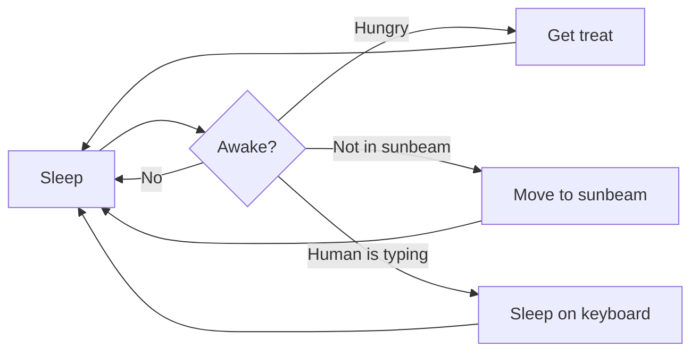

## 설명 요청 프롬프트 

1. 코드 해석 — 한 줄씩 무엇을 하는지
2. 문법 설명 — 함수, 메서드, 인자의 의미
3. 내부 동작 — 판다스·NumPy·모델 내부에서 어떤 일이 일어나는지
4. 도메인 설명 — 데이터가 실제 비즈니스에서 무엇을 의미하는지
5. 왜 이렇게 작성했는가 — 다른 방법과 비교해서 선택 이유
6. 캐글에서 자주 쓰이는 이유 — 대회에서의 활용 맥락
7. 실무에서는 어떻게 생각하는가 — 현업 관점에서의 해석과 주의점
8. 초보자가 헷갈리는 포인트 — 흔한 실수와 오해
9. 관련 개념 — 함께 알아두면 좋은 개념까지 연결

---
## 데이터 사이언스에 대한 
pandas, NumPy, 통계, 머신러닝, 시계열, SQL, 최적화, 도메인 지식

# Markdown Template

<u>밑줄</u>

취소선은 ~~물결 기호(tilde)~~ 를 사용하세요.

이텔릭체는 *별 기호(Asterisks)* 혹은 _언더바 기호(Underscore)_ 를 사용하세요.

<!-- 안녕하세요. 이게 주석이래 -->

- [x] 완료한 항목
- [ ] 미완료 항목

[GOOGLE](https://google.com)

[NAVER](https://naver.com "링크 설명(title)을 작성하세요.")

[상대적 참조](../users/login)

✅ <b>데이터 분석에서 시각화의 시작 : 질문   </b>   먼저 그래프를 고르는 게 아니라 질문을 하기.   